# <b>CONFIGURANDO GOOGLE CLOUD PARA DEPLOY E SERVICES</b>

## <b>1 - CONFIGURAR CONTA NO GOOGLE CLOUD</b>

> ### &nbsp;&nbsp;&nbsp;&nbsp;&nbsp;&nbsp;&nbsp;&nbsp; Primeiro de tudo, você necessitará de uma conta do Google, o que é utilizado em vários serviços da mesma, como: Gmail, Youtube, Maps, etc. Então se você não tem, crie <a href="https://accounts.google.com/signup/v2/webcreateaccount?flowName=GlifWebSignIn&flowEntry=SignUp" target="_blank">aqui!</a>
>
>  
>  
> 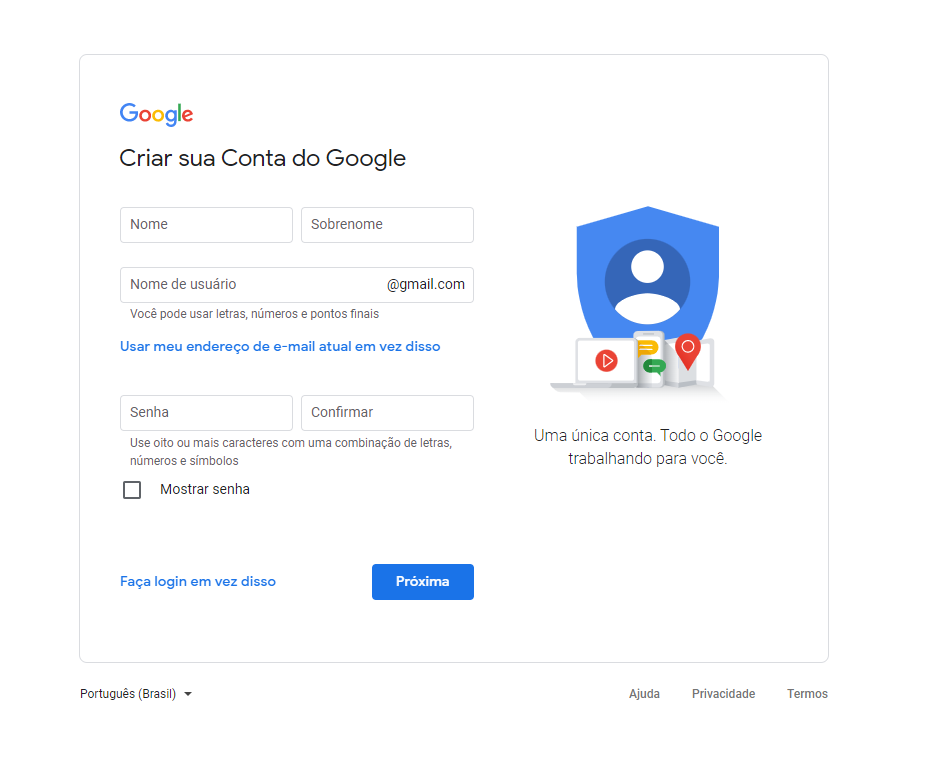
>  
>  
>
> ### &nbsp;&nbsp;&nbsp;&nbsp;&nbsp;&nbsp;&nbsp;&nbsp; Após você criar uma conta do Google, temos de utilizar ela para logar nos serviços de Cloud da Google, você pode ir lá clicando <a href="https://cloud.google.com/?hl=pt-br" target="_blank">aqui!</a> Em seguida, clique em "Acessar Console" que te levará para a página inicial da Cloud, se você não tiver nenhum projeto já registrado, ele pedirá para criar uma nova.
>
>  
>  
> 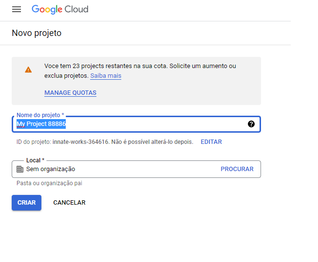
>  
>  
>
> ### &nbsp;&nbsp;&nbsp;&nbsp;&nbsp;&nbsp;&nbsp;&nbsp; Informe apenas o nome do projeto (no nosso caso, TMSProject), não será necessário procurar ou criar uma organização, isso envolve mais alguns passos como ter um domínio próprio da empresa e assuntos relacionados, o nosso objetivo é apenas criar instâncias para podermos testar nosso projeto funcionalmente online.
>
> ### &nbsp;&nbsp;&nbsp;&nbsp;&nbsp;&nbsp;&nbsp;&nbsp; Agora, iremos configurar nosso projeto com base em regras e autorização de uso, credenciais e em certos serviços que você pode privar para cada usuário dependendo de sua função.

 
 

## <b>2 - CONFIGURAR PROJETO</b>

> ### &nbsp;&nbsp;&nbsp; Após criar o projeto, provavelmente sua tela ficará assim:
>
>  
>  
> 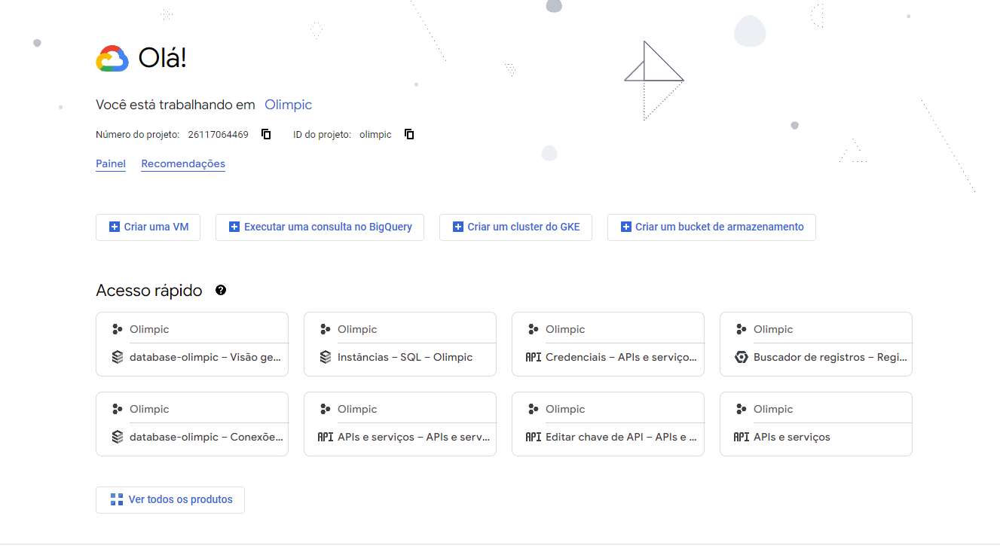
>  
>  
>
> ### &nbsp;&nbsp;&nbsp;&nbsp;&nbsp;&nbsp;&nbsp;&nbsp; Note que há algumas opções de criação de serviços, como: Virtual Machine, Consulta no BigQuery, Cluster e Bucket de Armazenamento. Nós iremos primeiramente acessar nosso Painel Principal, acima dessas opções. Após isso você verá a seguinte tela:
>
>  
>  
> 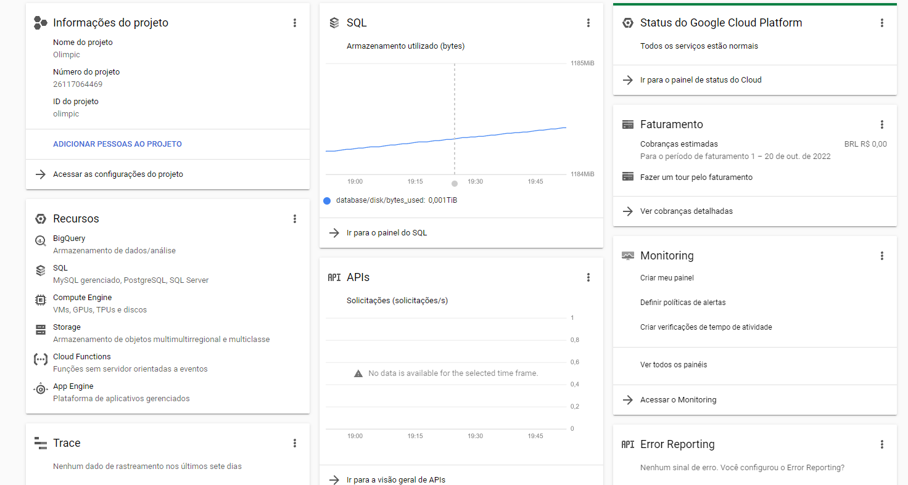
>  
>  
>
> ### &nbsp;&nbsp;&nbsp;&nbsp;&nbsp;&nbsp;&nbsp;&nbsp; Os gráficos irão aparecer automaticamente após ativar, criar e usar os serviços disponíveis. Agora iremos configurar as permissões para cada usuário que participa neste projeto. No primeiro card em "Informações de Projeto", clique em "ADICIONAR PESSOAS AO PROJETO", irá abrir uma aba com as seguintes opções: Recurso (mostra em qual projeto será afetado), Adicionar Participantes (na caixa de texto escrito "Novas Principais" onde poderá colocar email do google, grupo do google, conta de serviço ou domínio do google workspace) e Atribuir Papéis (onde será definido o que aquela pessoa poderá ver, alterar ou criar no projeto), como na imagem a seguir.
>
>  
>  
> 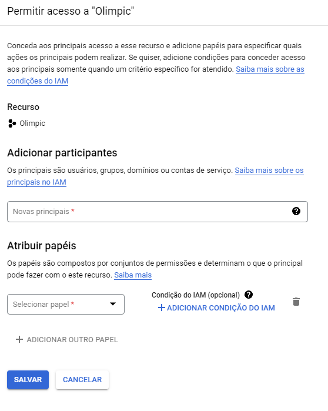
>  
>  
>
> ### &nbsp;&nbsp;&nbsp;&nbsp;&nbsp;&nbsp;&nbsp;&nbsp; E na aba "Selecionar Papel" você terá várias opções que poderá atribuir aquele usuário, como na imagem a seguir:
>
>  
>  
> 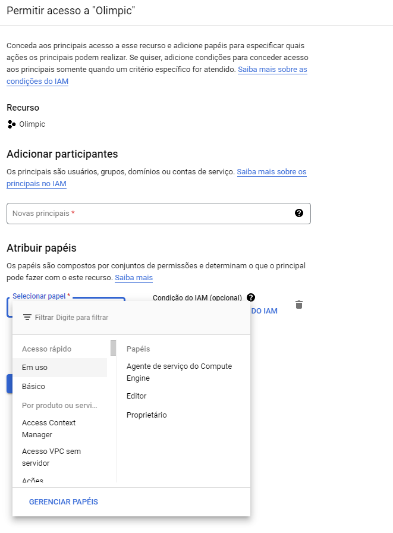
>  
>  
>
> ### &nbsp;&nbsp;&nbsp;&nbsp;&nbsp;&nbsp;&nbsp;&nbsp; No lado direito do painel de papéis, você pode definir ao usuário o papel básico em todo o projeto, como mostra ao lado direito do painel, ou atribuir de acordo com os serviços que estão sendo usados, na opção "Em uso" na lateral esquerda ou mais abaixo escolhendo manualmente.

 
 

## <b>3 - CONFIGURAR FATURAMENTO</b>

> ### &nbsp;&nbsp;&nbsp;&nbsp;&nbsp;&nbsp;&nbsp;&nbsp; <b>AVISO! A configuração do Faturamento requer um cartão de crédito para verificação do usuário e evitar ficar reavendo o plano de teste em diversas contas diferentes. O tempo de duração do plano de teste dura 3 meses no valor de U$300, após o término do valor de teste ou do período fornecido, será cobrado do seu cartão, então cuidado!</b>
>
> ### &nbsp;&nbsp;&nbsp;&nbsp;&nbsp;&nbsp;&nbsp;&nbsp; No Menu lateral esquerdo, abra as opções e selecione "Faturamento". Na parte superior, clique em <b>Iniciar Serviço Pago</b> ou <b>Configurar Faturamento</b> e após isso só seguir as instruções que for dadas em tela.
>
> ### &nbsp;&nbsp;&nbsp;&nbsp;&nbsp;&nbsp;&nbsp;&nbsp; Após isso sua tela de faturamento deverá ficar parecida com está:
>
>  
>  
> 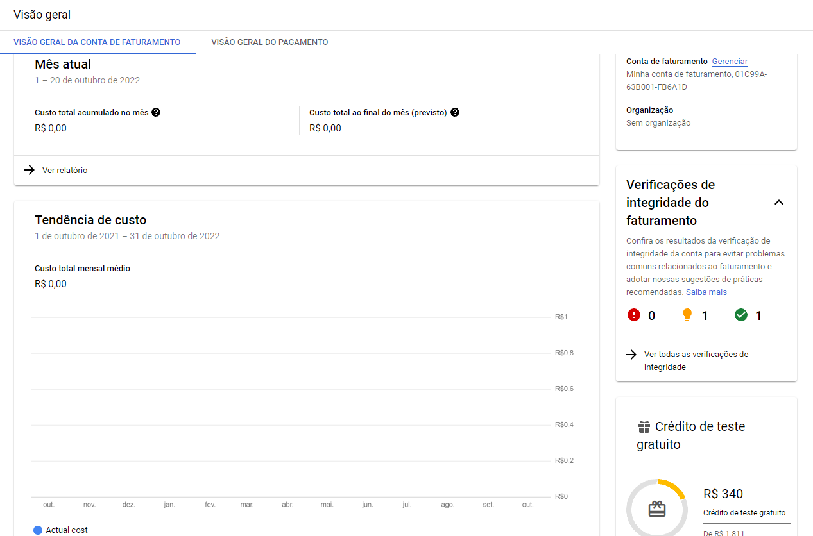
>  
>  

 
 

## <b>4 - ATIVAR SERVIÇOS</b>

> ### &nbsp;&nbsp;&nbsp;&nbsp;&nbsp;&nbsp;&nbsp;&nbsp; As ativações e criações de serviço são feita de acordo com sua demanda, como exemplo, o Directions API, uma API do Google Maps que te retorna rotas, precisamos ativá-la e então configurar uma credencial chamada API KEY.
>
>  
>  
> 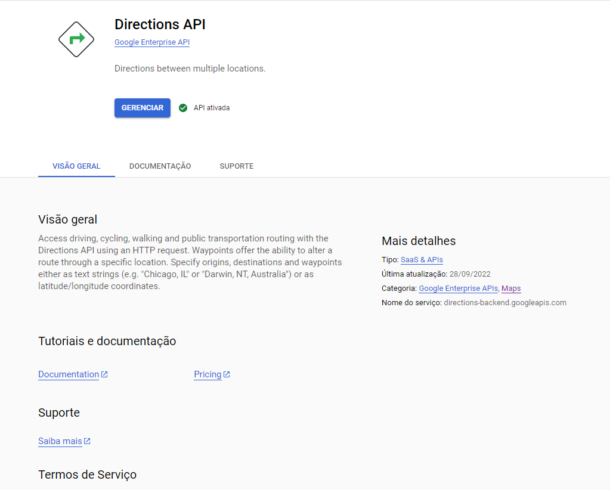
>  
>  
>
> ### &nbsp;&nbsp;&nbsp;&nbsp;&nbsp;&nbsp;&nbsp;&nbsp; Após ativar a API Desejada, você terá algumas abas abaixos como "Documentação", lá você poderá como utilizar os serviços nas tecnologias desejadas, como configurar, etc. No caso desta API, você verá na documentação que é necessária uma API KEY, que faremos agora na aba "Credenciais" em API.
>
>  
>  
> 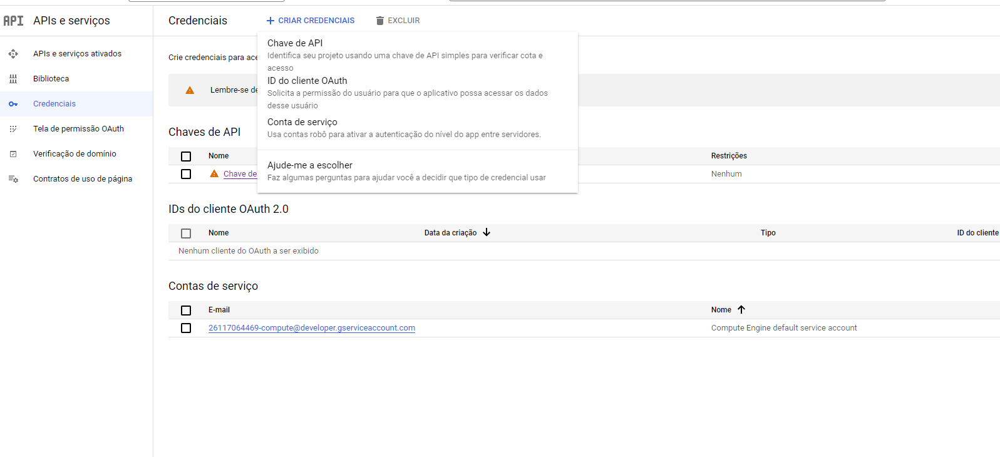
>  
>  
>
> ### &nbsp;&nbsp;&nbsp;&nbsp;&nbsp;&nbsp;&nbsp;&nbsp; Na seção das credenciais, na parte superior clique em "Criar Credencial", clique em "Chave de API".
>
>  
>  
> 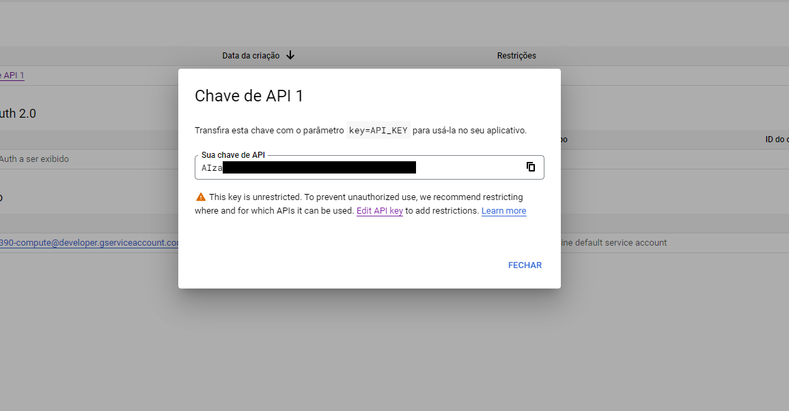
>  
>  
>
> ### &nbsp;&nbsp;&nbsp;&nbsp;&nbsp;&nbsp;&nbsp;&nbsp; Após criar sua chave, ele irá ser mostrada e pedirá para que você configure restrições da chave API.
>
>  
>  
> 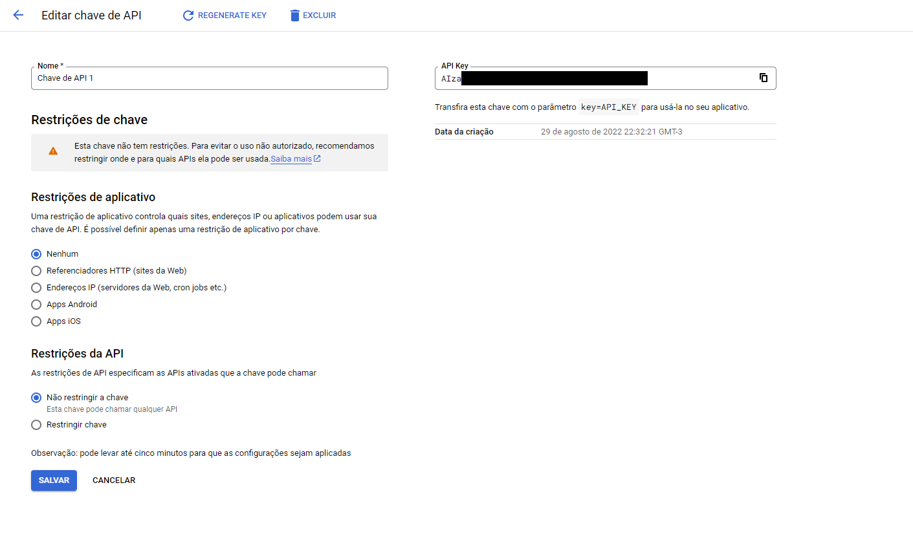
>  
>  
>
> ### &nbsp;&nbsp;&nbsp;&nbsp;&nbsp;&nbsp;&nbsp;&nbsp; Você poderá restringir por Referenciadores HTTP, Endereços IP, Apps Android ou iOS. No nosso caso, preferimos não restringir, mas por questões de segurança e mal uso de sua chave, você poderá fazer isso. Caso tenha uma provedora de internet com IP Dinâmico, não esqueça de instalar um DDNS ou Fixar seu IP de onde sua requisição irá ser feita para evitar erros de restrição.

 
 

## <b>5 - CONFIGURAR BANCO SQL</b>

> ### &nbsp;&nbsp;&nbsp;&nbsp;&nbsp;&nbsp;&nbsp;&nbsp; Para configurarmos uma instância de Banco de Dados MySQL, deveremos primeiro criar e configurar nossa máquina virtual, não se preocupe, pois a questão da instalação, configuração do S.O. e do Serviço de Banco de Dados o próprio Google toma conta. Então primeiro passo, criaremos nossa instância virtual como a seguir.
>
>  
>  
> 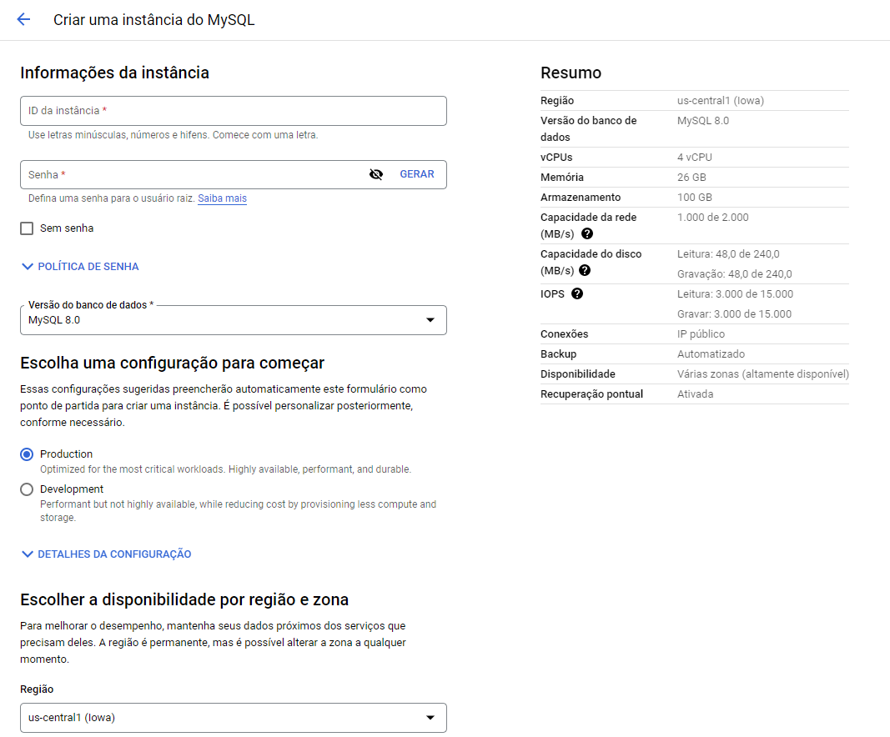
>  
>  
>
> ### &nbsp;&nbsp;&nbsp;&nbsp;&nbsp;&nbsp;&nbsp;&nbsp; Daremos um nome para nossa instância, criaremos a senha para o usuário raiz (root) e escolheremos a versão do nosso MySQL, na opção de Configuração Inicial, você pode decidir em Produção real (o que cria uma configuração para altas demandas) ou para Desenvolvimento (o que diminui a performance mas economiza nos custos), mais abaixo temos a disponibilidade por região, caso esteja criando o servidor no Brasil e deseja que haja menor latência de resposta e maior fidelidade de entrega de dados, escolha a região de São Paulo, possivelmente haverá duas alternativas, escolha a que melhor se encaixa com sua demanda.
>
>  
>  
> 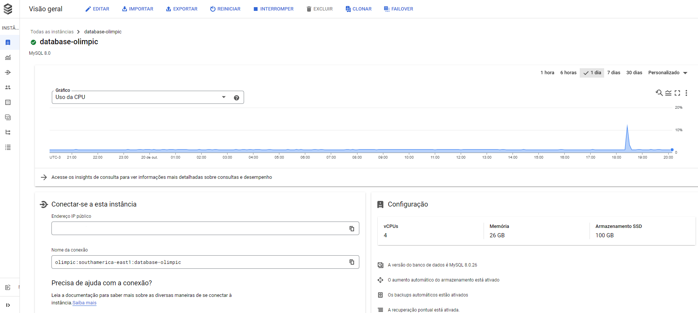
>  
>  
>
> ### &nbsp;&nbsp;&nbsp;&nbsp;&nbsp;&nbsp;&nbsp;&nbsp; Após

 
 

## <b>6 - CONFIGURAR NO MYSQL</b>

> ### &nbsp;&nbsp;&nbsp;&nbsp;&nbsp;&nbsp;&nbsp;&nbsp; Copie o endereço de IP PÚBLICO que consta na instância que você criou.
>
>  
>  
> 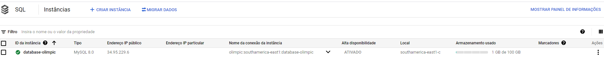
>
>  
>  
>
> ### &nbsp;&nbsp;&nbsp;&nbsp;&nbsp;&nbsp;&nbsp;&nbsp; Acesse seu MySQL e abra sua conexão ou cria uma caso não tenha.
>
>  
>  
> 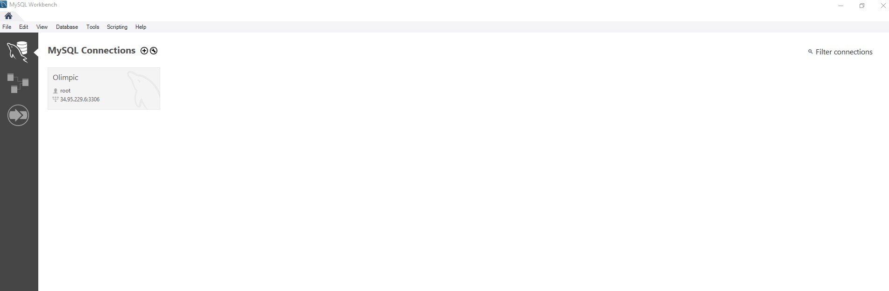
>  
>  
>
> ### &nbsp;&nbsp;&nbsp;&nbsp;&nbsp;&nbsp;&nbsp;&nbsp; Nas configurações da sua conexão, insira o IP PÚBLICO que você copio no "HOSTNAME". Assim, você criará uma conexão entre o google cloud e seu Mysql.
>
>  
>  
> 
>
>  
>  
>
> ### &nbsp;&nbsp;&nbsp;&nbsp;&nbsp;&nbsp;&nbsp;&nbsp; Logo, você irá inserir o password criado no google cloud na conexão do Mysql onde está escrito: "STORE IN VAULT...", posteriormente, teste a conexão.
>
>  
>  
> 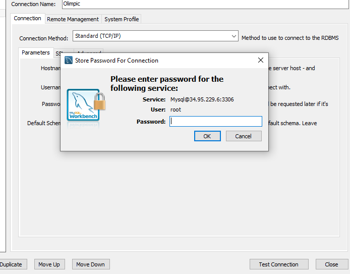
>
>  
>  
>
> ### &nbsp;&nbsp;&nbsp;&nbsp;&nbsp;&nbsp;&nbsp;&nbsp; Para finalizar, no menu de opções do google cloud, selecione SQL e irá abrir o menu da imagem abaixo, e então selecione CONEXÕES, após, só clicar em ADICIONAR REDE e insira o nome da sua rede e seu IP, click em SALVAR e está tudo pronto.
>
>  
>  
> 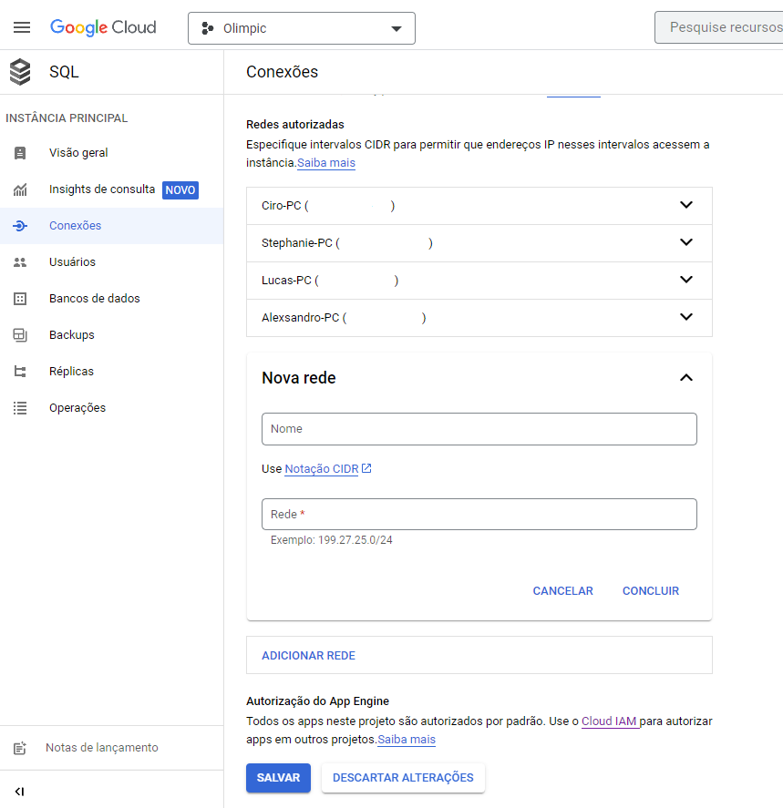
>
>  

